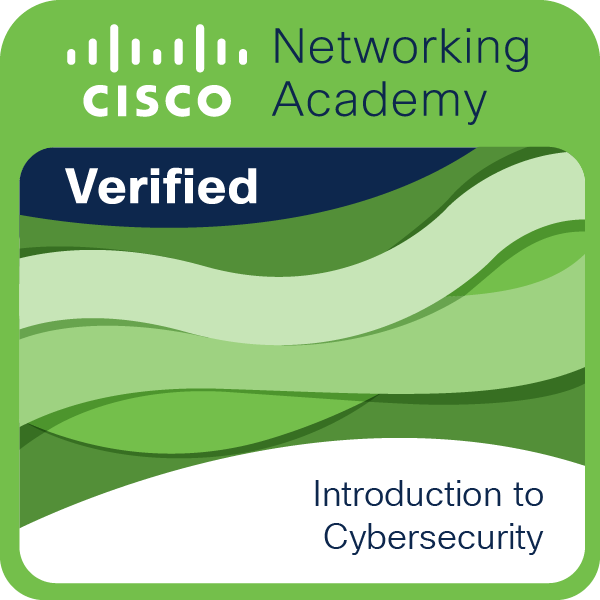

  <!-- Atenção: Substitua o NOME_DA_FOTO_DE_CIBER.png pelo nome do arquivo que você colocou na pasta assets -->
  

<h1>🛡️ Introdução à Cibersegurança</h1>
  <strong>Anotações dos Módulos 1 ao 6</strong> 
  <em>Formação Mulher Digital | Trilha de Cibersegurança</em>

---

## 📌 Visão Geral

Este espaço contém o resumo teórico completo e estruturado das aulas de **Introdução à Cibersegurança**, cobrindo do Módulo 1 ao Módulo 6. O objetivo é documentar os fundamentos da área, ameaças digitais, segurança em redes, proteção de dados e boas práticas de defesa.

---

## 📚 Módulos 1 ao 3: Fundamentos e Cenário de Ameaças

### 🌐 Módulo 1: O Mundo da Cibersegurança
* **O que é Cibersegurança:** Proteção de sistemas, redes, programas e dados contra ataques e acessos não autorizados.
* **A Tríade CIA (Pilar da Segurança):**
  * **Confidencialidade:** Garantir que a informação seja acessível apenas por pessoas autorizadas.
  * **Integridade:** Assegurar que os dados não sejam alterados ou corrompidos de forma não autorizada.
  * **Disponibilidade:** Garantir que os sistemas e dados estejam acessíveis quando necessários.
* **Atores de Ameaças (Hackers):**
  * **White Hat (Chapéu Branco):** Hackers éticos que testam segurança para corrigir vulnerabilidades.
  * **Black Hat (Chapéu Preto):** Atacantes maliciosos que buscam vantagem financeira ou causar danos.
  * **Grey Hat (Chapéu Cinza):** Atuam na linha tênue entre a ética e a ilegalidade, reportando vulnerabilidades sem autorização prévia.

### ⚠️ Módulo 2: Vulnerabilidades e Ameaças Comuns
* **Engenharia Social (Ataque ao Fator Humano):**
  * **Phishing:** Mensagens/e-mails falsos para induzir a vítima a fornecer credenciais ou clicar em links maliciosos.
  * **Spear Phishing:** Ataque de phishing direcionado e personalizado para uma vítima específica.
  * **Vishing / Smishing:** Phishing realizado por ligação telefônica (Vishing) ou SMS (Smishing).
* **Malwares:**
  * **Vírus:** Código malicioso que precisa da ação do usuário para se propagar e infectar arquivos.
  * **Worm:** Malware capaz de se autorreplicar sozinho pela rede sem intervenção humana.
  * **Trojan (Cavalo de Tróia):** Programa de aparência inofensiva que esconde funções maliciosas em seu interior.
  * **Ransomware:** Malware que criptografa os arquivos do sistema e exige o pagamento de um resgate (*ransom*) para liberação.

### 🌐 Módulo 3: Fundamentos de Segurança em Redes
* **Serviços Básicos de Rede:** Entendimento de IP (IPv4/IPv6), DNS (Resolução de nomes) e DHCP (Atribuição dinâmica de IPs).
* **Segmentação de Rede:** Divisão de uma rede em sub-redes menores para limitar o alcance de possíveis invasões.
* **Modelo OSI vs. TCP/IP:** Mapeamento de como os dados trafegam e onde os controles de segurança (como criptografia e cabeçalhos) atuam.

---

## 🛡️ Módulos 4 ao 6: Defesa, Proteção e Operações

### ⚔️ Módulo 4: Tipos de Ataques Avançados
* **Man-in-the-Middle (MitM):** Interceptação não autorizada de comunicações entre dois pontos em uma rede.
* **DoS e DDoS (Denegação de Serviço):** Sobrecarga intencional de um servidor por múltiplas origens para torná-lo indisponível.
* **Ataques a Aplicações Web:** Injeção de Código (SQL Injection), Cross-Site Scripting (XSS) e exploração de falhas em APIs.

### 🔒 Módulo 5: Mecanismos de Proteção e Criptografia
* **Tecnologias de Borda e Perímetro:**
  * **Firewalls:** Inspeção e filtragem de tráfego com base em regras de segurança.
  * **IDS/IPS (Detecção/Prevenção de Intrusão):** Sistemas de monitoramento proativo de comportamentos suspeitos.
* **Criptografia:**
  * **Simétrica:** Mesma chave para criptografar e descriptografar (ex: AES).
  * **Assimétrica:** Par de chaves pública e privada (ex: RSA).
* **Autenticação Segura:** Implementação de Autenticação Multifator (MFA) e política de senhas fortes.

### 📋 Módulo 6: Gestão de Riscos, Políticas e Resposta a Incidentes
* **Princípio do Menor Privilégio (Least Privilege):** Conceder ao usuário apenas o acesso estritamente necessário para sua função.
* **Gestão de Patches:** Atualização contínua de software para correção de vulnerabilidades conhecidas.
* **Resposta a Incidentes:**
  1. Preparação
  2. Detecção e Análise
  3. Contenção, Erradicação e Recuperação
  4. Atividades Pós-Incidente (Lições Aprendidas)

---

## 🧠 Conclusão e Reflexões
> A segurança da informação exige uma visão holística: tecnologia de ponta, processos rígidos e conscientização do usuário final.
>
> A evolução constante das ameaças exige que profissionais de tecnologia pratiquem o aprendizado contínuo (*Growth Mindset*) e entendam a defesa em camadas (*Defense in Depth*).

---

<b>Visualizar Texto Original</b>

🛡️ Introdução à Cibersegurança — Anotações dos Módulos 1 ao 6

Formação Mulher Digital | Trilha de Cibersegurança
📌 Visão Geral

Este espaço contém o resumo teórico completo e estruturado das aulas de Introdução à Cibersegurança, cobrindo do Módulo 1 ao Módulo 6. O objetivo é documentar os fundamentos da área, ameaças digitais, segurança em redes, proteção de dados e boas práticas de defesa.
📚 Módulos 1 ao 3: Fundamentos e Cenário de Ameaças

🌐 Módulo 1: O Mundo da Cibersegurança

O que é Cibersegurança: Proteção de sistemas, redes, programas e dados contra ataques e acessos não autorizados.
A Tríade CIA (Pilar da Segurança):
Confidencialidade: Garantir que a informação seja acessível apenas por pessoas autorizadas.
Integridade: Assegurar que os dados não sejam alterados ou corrompidos de forma não autorizada.
Disponibilidade: Garantir que os sistemas e dados estejam acessíveis quando necessários.
Atores de Ameaças (Hackers):
White Hat (Chapéu Branco): Hackers éticos que testam segurança para corrigir vulnerabilidades.
Black Hat (Chapéu Preto): Atacantes maliciosos que buscam vantagem financeira ou causar danos.
Grey Hat (Chapéu Cinza): Atuam na linha tênue entre a ética e a ilegalidade, reportando vulnerabilidades sem autorização prévia.
⚠️ Módulo 2: Vulnerabilidades e Ameaças Comuns

Engenharia Social (Ataque ao Fator Humano):
Phishing: Mensagens/e-mails falsos para induzir a vítima a fornecer credenciais ou clicar em links maliciosos.
Spear Phishing: Ataque de phishing direcionado e personalizado para uma vítima específica.
Vishing / Smishing: Phishing realizado por ligação telefônica (Vishing) ou SMS (Smishing).
Malwares:
Vírus: Código malicioso que precisa da ação do usuário para se propagar e infectar arquivos.
Worm: Malware capaz de se autorreplicar sozinho pela rede sem intervenção humana.
Trojan (Cavalo de Tróia): Programa aparente inofensivo que esconde funções maliciosas em seu interior.
Ransomware: Malware que criptografa os arquivos do sistema e exige o pagamento de um resgate (ransom) para liberação.
🌐 Módulo 3: Fundamentos de Segurança em Redes

Serviços Básicos de Rede: Entendimento de IP (IPv4/IPv6), DNS (Resolução de nomes) e DHCP (Atribuição dinâmica de IPs).
Segmentação de Rede: Divisão de uma rede em sub-redes menores para limitar o alcance de possíveis invasões.
Modelo OSI vs. TCP/IP: Mapeamento de como os dados trafegam e onde os controles de segurança (como criptografia e cabeçalhos) atuam.
🛡️ Módulos 4 ao 6: Defesa, Proteção e Operações

⚔️ Módulo 4: Tipos de Ataques Avançados

Man-in-the-Middle (MitM): Interceptação não autorizada de comunicações entre dois pontos em uma rede.
DoS e DDoS (Denegação de Serviço): Sobrecarga intencional de um servidor por múltiplas origens para torná-lo indisponível.
Ataques a Aplicações Web: Injeção de Código (SQL Injection), Cross-Site Scripting (XSS) e exploração de falhas em APIs.
🔒 Módulo 5: Mecanismos de Proteção e Criptografia

Tecnologias de Borda e Perímetro:
Firewalls: Inspeção e filtragem de tráfego com base em regras de segurança.
IDS/IPS (Detecção/Prevenção de Intrusão): Sistemas de monitoramento proativo de comportamentos suspeitos.
Criptografia:
Simétrica: Mesma chave para criptografar e descriptografar (ex: AES).
Assimétrica: Par de chaves pública e privada (ex: RSA).
Autenticação Segura: Implementação de Autenticação Multifator (MFA) e política de senhas fortes.
📋 Módulo 6: Gestão de Riscos, Políticas e Resposta a Incidentes

Princípio do Menor Privilégio (Least Privilege): Conceder ao usuário apenas o acesso estritamente necessário para sua função.
Gestão de Patches: Atualização contínua de software para correção de vulnerabilidades conhecidas.
Resposta a Incidentes:
Preparação
Detecção e Análise
Contenção, Erradicação e Recuperação
Atividades Pós-Incidente (Lições Aprendidas)
🧠 Conclusão e Reflexões

A segurança da informação exige uma visão holística: tecnologia de ponta, processos rígidos e conscientização do usuário final.
A evolução constante das ameaças exige que profissionais de tecnologia pratiquem o aprendizado contínuo (Growth Mindset) e entendam a defesa em camadas (Defense in Depth).

