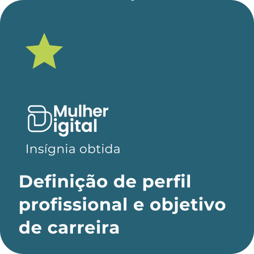

  

  # 🧠 Soft Skills & Desenvolvimento Profissional
  **Formação Mulher Digital • Trilha de Desenvolvimento de Carreira**

---

## 📌 1. Introdução
Mapeamento de competências sociocomportamentais, inteligência emocional e posicionamento estratégico de carreira desenvolvidos ao longo do programa **Mulher Digital**. Este documento consolida objetivos, diferenciais de atuação e presença profissional no mercado tech.

---

## 🪞 2. Identidade & Posicionamento

### 📖 Trajetória Profissional
* **Formação:** Graduada em Análise e Desenvolvimento de Sistemas (ADS).
* **Certificações & Capacitações:** Programadora de Sistemas pelo SENAC SP (*Programa Transforme-se*) e aluna da *Formação Mulher Digital*.
* **Experiência:** Atuação como assistente de gestão de projetos em consultoria de TI, unindo visão estratégica, mapeamento de processos e foco em resolução de problemas.
* **Objetivo de Carreira:** Transição orientada para a área de **Cibersegurança e Redes**.

---

## 🎯 3. Matriz de Competências

| Competência | Aplicação Prática |
| :--- | :--- |
| 🗣️ **Comunicação Estratégica** | Alinhamento claro de requisitos entre equipes técnicas e stakeholders de negócio. |
| 🧩 **Resolução de Problemas** | Análise crítica de causas-raiz e mitigação de gargalos operacionais. |
| 🤝 **Trabalho Colaborativo** | Integração ágil em times multidisciplinares com foco em entregas contínuas. |
| 🔄 **Adaptabilidade & Resiliência** | Aprendizado contínuo frente a novos cenários, tecnologias e desafios corporativos. |

---

## 📄 4. Documentos & Currículo

> ⏳ **Status:** *Currículo e portfólio profissional em processo de atualização.*

* 📄 **Currículo (CV):** `[Em breve / Em desenvolvimento]`
* 🔗 **LinkedIn:** [Perfil Profissional](https://linkedin.com)
* 🐙 **GitHub:** [fer-isa](https://github.com/fer-isa)
